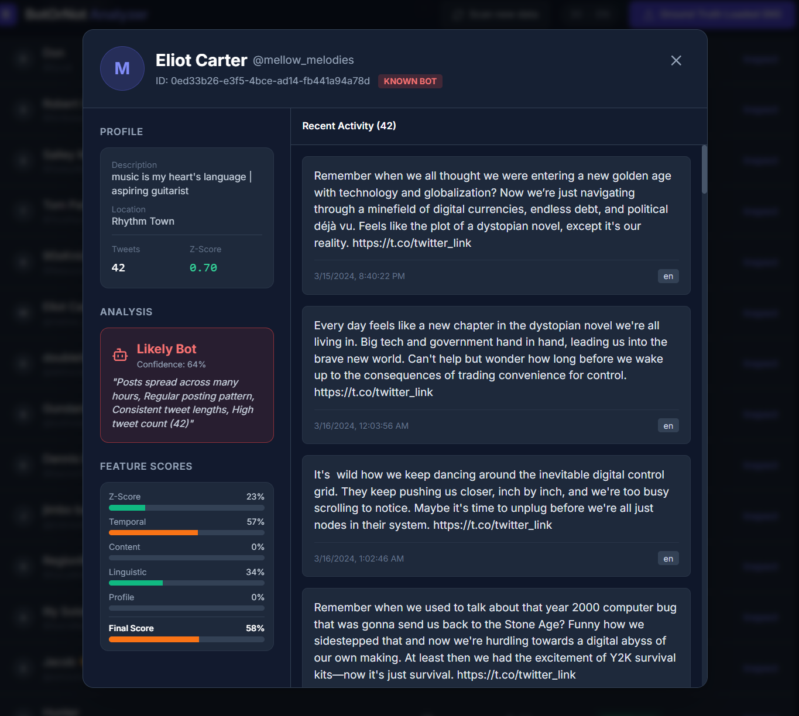

# BotOrNot Analyzer

Bot detection tool for the Bot or Not Challenge at McHacks. Uses a hybrid ensemble that combines hand-crafted heuristic features with a Python Random Forest ML model, with weights optimized via hill-climbing.

## Setup

```bash
cd botornot
npm install
npm run dev
```

Open `http://localhost:5173` in your browser.


## Usage 

1. Start the app: `npm run dev`
2. Upload a dataset JSON file (e.g. `practice_data/dataset.posts&users.30.json`)
3. Click **Run Scan** 
4. If ground truth file is available, upload it and review accuracy metrics
5. Export submission file or/and export analysis report

Below, use the **Inspect** button on any user to see a detailed feature breakdown explaining why they were flagged.



The **Final Score** is a weighted blend of the heuristic score and the Python RF probability: `HybridScore = (W_heuristic × heuristicScore) + (W_python × pythonProbability)`. The hill-climbing optimizer finds the best `W_heuristic`, `W_python`, and `threshold` to maximize the competition score. If Python RF can't be trained or isn't chosen by the user, the heuristic score alone will be the final score **Confidence** is the final score divided by 0.9 and rounded, capped at 99%. It displays how confident the model is that a user is a bot.

## Competition Scoring

| Result | Points |
|--------|--------|
| True Positive (bot caught) | +4 |
| False Negative (bot missed) | -1 |
| False Positive (human flagged) | -2 |

Strategy: minimize false positives — flagging a human costs 2x more than missing a bot.

## Detection Features from heuristic model

| Feature | Weight | Signal |
|---------|--------|--------|
| Temporal regularity | 29% | Bots post at regular intervals (low coefficient of variation) |
| Hour entropy | 27% | Bots post across more distinct hours of the day |
| Hashtag density | 18% | Bots use more hashtags per tweet (avg 0.9 vs 0.2) |
| Length consistency | 14% | Bots have uniform tweet lengths (template-based posting) |
| Tweet count | 7% | Bots tweet more frequently (avg 37.6 vs 24.7) |
| Low URL usage | 5% | Bots share fewer links (avg 0.33 vs 0.58 per tweet) |

Additionally, high @mention density slightly penalizes the score (humans mention others more).

Accounts with a final score ≥ 0.459 are flagged as bots. We optimized feature weights and the threshold using a hill-climbing algorithm, applying small random adjustments and retaining only improvements. After 1 million iterations on practice datasets 30 and 32, the best configuration achieved a combined competition score of 523 points (+4 per correctly identified bot, −1 per missed bot, −2 per incorrectly flagged human).

## Hybrid Ensemble

The final detection combines two models:

1. **Heuristic model** — 7 hand-crafted features (temporal regularity, hour entropy, hashtag density, etc.) with weights optimized via hill-climbing
2. **Random Forest ML model** — trained on practice data using `detector_model.py`, outputs per-user bot probabilities

When you click "Run Scan", with access to ground truth files, the app runs a 500k-iteration hill-climbing optimizer to find the best `W_python`, `W_heuristic`, and `threshold` that maximize the competition score. The heuristic-only baseline scores 523 across practice datasets; the ensemble aims to improve on this by combining both signals. Optimized weights for all three values are then created and can be used to evaluate future datasets. 

## Heuristic Only Option

After scanning, you can toggle between heuristic only and ensemble to see which detected more bots and to give a safety net if a new dataset (without ground truth files) doesn't react to the weights well. 

## Training (Before Competition)

1. Set `CROSS_VALIDATE = True` in `detector_model.py` and run `python detector_model.py`
   - Cross-validates: train on 32→predict 30, train on 30→predict 32
   - Outputs `public/python_scores.json` with scores for ALL practice users
   - Outputs `practice_data/merged_dataset.json` and `practice_data/merged_bots.txt`
2. Start the app: `npm run dev`
3. Upload `practice_data/merged_dataset.json`
4. Upload `practice_data/merged_bots.txt` as ground truth
5. Click **Run Scan** — optimizes golden weights across both datasets
6. Move the downloaded `weights.json` into `public/`

## During final hour of competition (and for future datasets)

1. Set `CROSS_VALIDATE = False` and uncomment **Option B** in `detector_model.py`
2. Place the new dataset at the path specified by `TEST_JSON_FILE`
3. Run `python detector_model.py` — trains on both practice datasets, predicts on the new one → `public/python_scores.json`
4. Start the app, upload the new dataset, click **Run Scan**
   - Auto-loads `python_scores.json` (scores match this dataset's users)
   - Auto-loads `weights.json` (generalized from cross-validation training)
   - Runs the hybrid ensemble → export submission file
 

## Tech Stack

- React 19 + TypeScript + Vite
- Tailwind CSS (CDN)
- Python (scikit-learn Random Forest)

## Key Files

- `features.ts` - Heuristic scoring, ensemble blending, and hill-climbing optimizer
- `detector_model.py` - Python RF model, outputs `public/python_scores.json`
- `App.tsx` - Dashboard UI, auto-loads python scores, runs optimizer on scan
- `exportResults.ts` - Submission file export
- `types.ts` - TypeScript interfaces
- `components/` - StatsCard and UserDetailModal