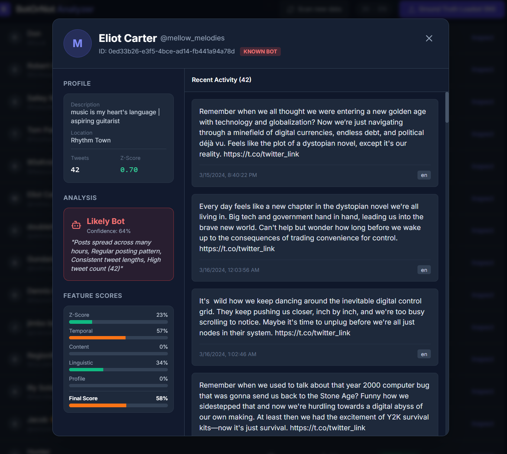

# BotOrNot Analyzer

Bot detection tool for the Bot or Not Challenge at McHacks. Uses a hybrid ensemble that combines hand-crafted heuristic features with a Random Forest ML model (running entirely in the browser), with weights optimized via hill-climbing.

## Live App

[https://botornot-steel.vercel.app/](https://botornot-steel.vercel.app/)

## Usage

1. Open the app
2. Upload a dataset JSON file (e.g. `practice_data/dataset.posts&users.30.json`)
3. Click **Run Scan** 
4. If ground truth file is available, upload it and review accuracy metrics
5. Export submission file or/and export analysis report

Below, use the **Inspect** button on any user to see a detailed feature breakdown explaining why they were flagged.

The **Final Score** is a weighted blend of the heuristic score and the Python RF probability: `HybridScore = (W_heuristic × heuristicScore) + (W_python × pythonProbability)`. The hill-climbing optimizer finds the best `W_heuristic`, `W_python`, and `threshold` to maximize the competition score. If Python RF can't be trained or isn't chosen by the user, the heuristic score alone will be the final score **Confidence** is the final score divided by 0.9 and rounded, capped at 99%. It displays how confident the model is that a user is a bot.

## Competition Scoring

| Result | Points |
|--------|--------|
| True Positive (bot caught) | +4 |
| False Negative (bot missed) | -1 |
| False Positive (human flagged) | -2 |

Strategy: minimize false positives — flagging a human costs 2x more than missing a bot.

## Detection Features from heuristic model

| Feature | Weight | Signal |
|---------|--------|--------|
| Temporal regularity | 29% | Bots post at regular intervals (low coefficient of variation) |
| Hour entropy | 27% | Bots post across more distinct hours of the day |
| Hashtag density | 18% | Bots use more hashtags per tweet (avg 0.9 vs 0.2) |
| Length consistency | 14% | Bots have uniform tweet lengths (template-based posting) |
| Tweet count | 7% | Bots tweet more frequently (avg 37.6 vs 24.7) |
| Low URL usage | 5% | Bots share fewer links (avg 0.33 vs 0.58 per tweet) |

Additionally, high @mention density slightly penalizes the score (humans mention others more).

Accounts with a final score ≥ 0.459 are flagged as bots. We optimized feature weights and the threshold using a hill-climbing algorithm, applying small random adjustments and retaining only improvements. After 1 million iterations on practice datasets 30 and 32, the best configuration achieved a combined competition score of 523 points (+4 per correctly identified bot, −1 per missed bot, −2 per incorrectly flagged human).

## Hybrid Ensemble

The final detection combines two models:

1. **Heuristic model** — 7 hand-crafted features (temporal regularity, hour entropy, hashtag density, etc.) with weights optimized via hill-climbing
2. **Random Forest ML model** — pre-trained on practice data, exported as JSON (`public/rf_model.json`), and run directly in the browser via `rfModel.ts`. No Python needed at runtime.

When you click "Run Scan", the app loads the RF model, computes per-user bot probabilities in-browser, and if ground truth is available, runs a 500k-iteration hill-climbing optimizer to find the best `W_python`, `W_heuristic`, and `threshold` that maximize the competition score. The heuristic-only baseline scores 523 across practice datasets; the ensemble aims to improve on this by combining both signals. Optimized weights for all three values are then created and can be used to evaluate future datasets.

## Heuristic Only Option

After scanning, you can toggle between heuristic only and ensemble to see which detected more bots and to give a safety net if a new dataset (without ground truth files) doesn't react to the weights well. 

## Training the RF Model (One-Time)

The RF model is pre-trained in Python and exported as `public/rf_model.json` for browser inference. To retrain:

1. Run `python detector_model.py` with Option B (train on datasets 30+32)
2. This exports `public/rf_model.json` (0.9 MB, 200 trees, max_depth=15)
3. The JSON file ships with the app — no Python needed at runtime

## Using the App

1. Upload a dataset JSON, click **Run Scan**
   - The RF model runs in-browser (loaded from `rf_model.json`)
   - If ground truth is available, the optimizer finds the best ensemble weights and downloads `weights.json` — move it to `public/` for future use
   - If no ground truth, loads saved `weights.json` from `public/` automatically
2. Toggle between **Ensemble** and **Heuristic Only** to compare results
3. Export the submission file
 

## Tech Stack

- React 19 + TypeScript + Vite
- Tailwind CSS (CDN)
- Random Forest (pre-trained in Python/scikit-learn, inference runs in-browser)

